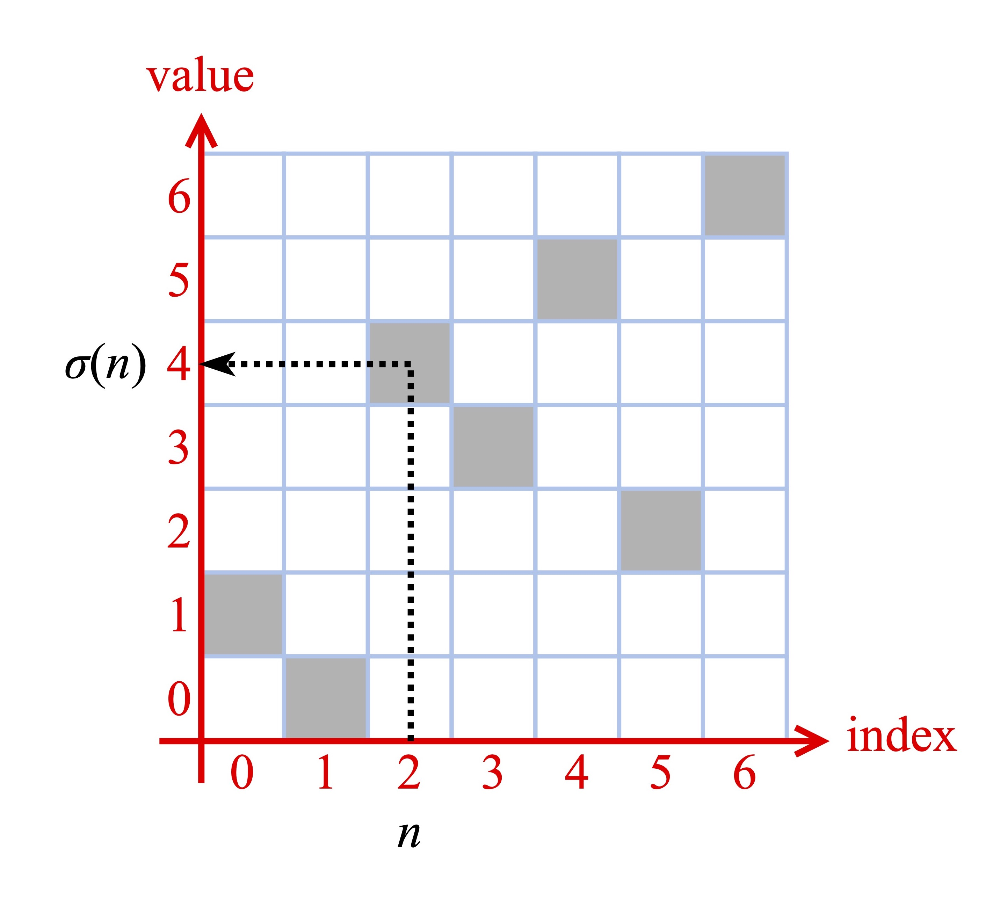
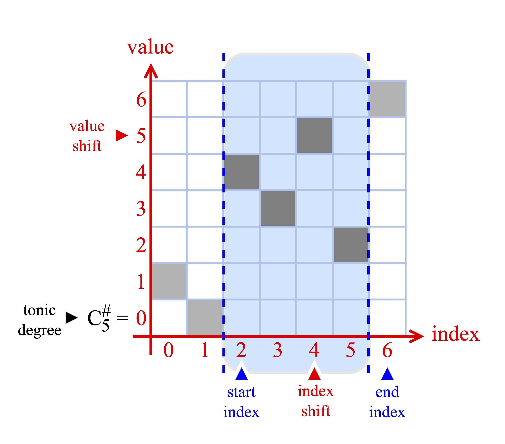
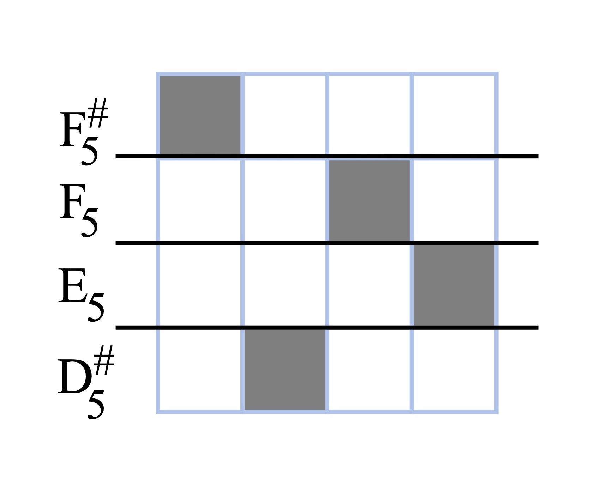

# Bebop Lines

*Bebop Lines* is a Python package for generating and manipulating rising/falling systems of melodic cells. It is a utility for creating long, musically meaningful chromatic phrases, i.e., for creating bebop-like melodic lines.

The package uses methods closely related to the [*tone row*](https://en.wikipedia.org/wiki/Tone_row)-manipulating techniques of 20th century [*serialism*](https://en.wikipedia.org/wiki/Serialism), based on permutation of the order of notes in chromatic scales.

The actions of permutation groups on sequences (of notes) plays a central role in the present package. The package includes tools for implementing group actions and closely related transformations on melodic lines, and tools for printing these lines to either `midi` or `wav` files.


## Purpose and Design

### Bebop lines, serialism, and dense chromatic movement
One central feature of the sorts of melodic lines that appear in bebop horn solos is a predominance of chromatically melodies, often appearing in rising and falling sequences, with pivot tones revealing the underlying key.

Suppose given an arbitrary *scale*, meaning any sequence of $N$ distinct pitches $(p_0,\ p_1,\ p_2,\ \cdots,\ p_{N-1})$ satisfying

$$
p_0\ <\ p_1\ <\ p_2\ <\ \cdots\ <\ p_{N-1}.
$$

The set of all possible melodic cells constituing full runs of the scale is none other than the set of permutations of the pitches in our scale:

$$
\text{Perm}(\{p_0,\ p_1,\ p_2,\ \dots,\ p_{N-1}\})
$$

### The `PermutationBar` class
[...]

$$
\begin{array}{ccc}
0 & & 1 & & 2 & & 3 & & 4 & & 5 & & 6 \\
\downarrow & & \downarrow & & \downarrow & & \downarrow & & \downarrow
& & \downarrow & & \downarrow \\
1 & & 0 & & 4 & & 3 & & 5 & & 2 & & 6
\end{array}
$$

Call this permutation $\sigma$. The *graph* of this particular permutation, that is, the set of all pairs $(n,\ \sigma(n))$ in the square $(0,\ 1,\ \dots,\ N-1)\times(0,\ 1,\ \dots,\ N-1)$

<figure style="text-align: center;">
  
  <figcaption>Figure 1: Previous permutation encoded as a graph</figcaption>
</figure>


[...]

<figure style="text-align: center;">

  <figcaption>Figure 2: Depiction of the PermutationBar class.</figcaption>
</figure>

$$
\text{output}(\mathscr{B})
\ =\ 
(5, 2, 6, 1)
$$


[...]

<figure style="text-align: center;">

  <figcaption>Figure 3: MIDI "piano roll" printed from PermutationBar instance.</figcaption>
</figure>

### The `group_action` submodule

[...]

## Installation

Clone the repository:

```bash
git clone https://github.com/TYLERSFOSTER/bebop_lines
```

Once the repository is cloned, go to the root directory:

```bash
cd bebop_lines
```

Install using pip or PDM. With pip:
```bash
pip install .
```
With PDM:
```bash
pdm add .
```

<!-- ## Usage

Here’s a simple example of how to use it:

```python
from bebop_lines import do_awesome_thing

result = do_awesome_thing("world")
print(result)  # Hello, world! Stay awesome.
```

## Features

- 🚀 Easy-to-use API  
- ✅ Zero dependencies  
- 🧪 Fully tested  
- 📦 Ready for PyPI

## API Reference

### `do_awesome_thing(name: str) -> str`

Returns a personalized awesome message.

```python
do_awesome_thing("Alice")
# "Hello, Alice! Stay awesome."
``` -->

## Contributing

We welcome contributions!

1. Fork the repository  
2. Create your feature branch (`git checkout -b feature/thing`)  
3. Commit your changes (`git commit -am 'Add awesome thing'`)  
4. Push to the branch (`git push origin feature/thing`)  
5. Open a pull request

To set up the project locally:

```bash
git clone https://github.com/yourusername/bebop_lines.git
cd bebop_lines
pdm install
```

Run the tests:

```bash
pytest
```

## License

This project is licensed under the MIT License. See the [LICENSE](LICENSE) file for details.

## Authors

- [@TYLERSFOSTER](https://github.com/TYLERSFOSTER)
